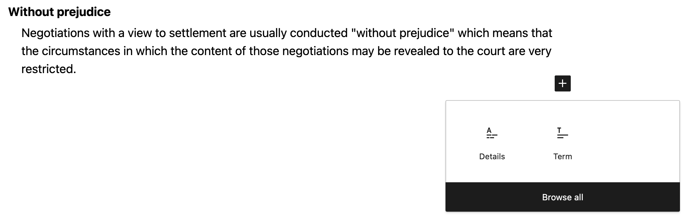

## Table of contents
{: .no_toc .text-delta }

1. TOC
{:toc}

## Overview

  
  <ol>
    <li id="annotation-overview" class="label" style="top: 0.7%; left: 23%;" >Overview</li>
    <li id="annotation-new-block" class="label" style="top: 6%; left: 5%;" >New block</li>
    <li id="annotation-toolbar" class="label" style="top: 27%; left: 34%;" >Toolbar</li>
    <li id="annotation-block-settings" class="label" style="top: 14%; right: 0%;" >Block settings</li>
    <li id="annotation-html-anchor" class="label" style="top: 27%; right: 21%;" >HTML anchor</li>
  </ol>

When you edit a page (see [pages](pages.md)) you’ll use the block editor. 
The block editor is used for creating and editing content on the justice website.

A block is a unit of content that can be moved and edited independently of other blocks.

To see a List View of the blocks on a page, click the Overview button towards the top left of the editor.
The list view is useful for quickly navigating between blocks, and changing the order of blocks.

{: .highlight }
See the annotated screenshot above for the location of the [Overview](#annotation-overview) button.

### Add a block

To add a new block, click the `+` icon at the top left of the editor.

{: .highlight }
See the screenshot for the location of the [New block (+)](#annotation-new-block) button.

Alternatively, press `Enter` at the end of a block to create a new block below it.
Type forward slash '/' to see a list of block types you can add, start typing to select the one you want.

### Edit a block

To edit a block, click on the block you want to edit. With the majority of blocks you can usually just start typing.

Blocks like tables, footnotes, and definition lists have additional settings or instructions, 
as explained in the [Block types](#block-types) section below.

When you're editing a block, you'll see a toolbar appear above the block. This toolbar contains options for formatting the block, and for moving or deleting the block.

Along the right hand side of the editor, you'll see a sidebar with additional block settings. This sidebar will change depending on the block you have selected.

{: .highlight }
See the screenshot for the location of the [toolbar](#annotation-toolbar) & [block settings](#annotation-block-settings).

## Block types

### Tables

Upon creation of a table block, you can define the number of rows and columns.

Rows and columns can be added or removed later by clicking Edit table icon towards the right of the toolbar.

### Footnotes

In previous versions of the justice website, footnotes were created using links and anchor tags. 
The current content of the site works exactly like that. 
For example there are links throughout the content that link to footnotes at the bottom of the page.
These can be created and edited in much the same way as any other link.

But, the block editor also has a built-in block for footnotes, which is a more user-friendly way to create footnotes.

To use the footnote block:

1. Highlight the text you want to turn into a footnote.
1. Click the down arrow towards the right of the toolbar.
1. Select the Footnote block from the dropdown menu.
1. A Footnote block will be added to the bottom of the page.
1. Type the footnote text into the block - the links will be automatically created for you.

### Definition lists

The definition list block is used to create a list of terms and their definitions.

This is the ideal block to make a user and SEO friendly glossary of terms.

To use this block follow these steps:

1. Create a Definition List block.
1. Click the + icon to add a Definition Term block - this is the term that will be defined.
1. Click the + icon to add a Definition Description block - this is the definition of the term.
1. Repeat the above steps to add more terms and definitions.

### Inline menu - child pages

This block is used to insert a menu that will display child pages of the current page.

It's currently only used on the 'Help' page.

### Search - child pages

This block is used to insert a search bar that will search child pages of the current page.

It's currently only used on the 'Civil Procedure Rules' page.

### To the top

This block is used to create a link that will take the user back to the top of the page.
As it may be added many times in a single page it's useful to remember the shortcut to add it.

Press enter, then type `/` and then type `top` and press enter.

## Links and Jump Links

### Creating a link

To add links to content, follow these steps:

1. Highlight the text you want to link from.
1. Click the Link icon in the toolbar.
1. In the URL field, enter the URL you want to link to.
  1. This can be an external URL like `https://www.gov.uk/search/news-and-communications`
  1. Or, an internal URL like `/courts/procedure-rules/civil`
  1. Or, a jump link target like `#my-anchor`

### Creating a jump link target

Jump links can be used to link to a specific part of a page. This can be done one of 2 ways.

If you're editing a block, you can jump to the block by following these steps: 

1. On the right hand side of the editor, click the Advanced tab.
1. In the HTML anchor field, enter the anchor name.
1. This should be a unique name that describes the content, e.g. `my-block-anchor`.
1. You can now create a link by following the steps in `Creating a link` and using the anchor name as the URL, 
  e.g. `#my-block-anchor`

{: .highlight }
See the annotated screenshot above for the location of the [HTML anchor](#annotation-html-anchor) field.

If the block doesn't have the HTML Anchor field, or, you want to jump to the middle of a block, follow these steps:

1. Write a space character where you want the anchor to be.
1. Highlight the space character.
1. Click the down arrow towards the right of the toolbar.
1. Select 'Anchor' from the dropdown menu.
1. In the Anchor field, enter the anchor name.
1. This should be a unique name that describes the content, e.g. `my-inline-anchor`.
1. You can now create a link by following the steps in `Creating a link` and using the anchor name as the URL, 
  e.g. `#my-inline-anchor`

### Identifying a jump link target

When you're editing a block you can see if it has a block level anchor by following these steps:

1. Select the block you want to check.
1. On the right hand side of the editor, click the Advanced tab.
1. In the HTML anchor field, you'll see the anchor name if it has one.

{: .highlight }
See the annotated screenshot above for the location of the [HTML anchor](#annotation-html-anchor) field.

Inline anchors are identified by a blue underline, these may be single spaces, or in some cases one or more word.
To spot these more easily follow these steps:

1. Highlight the space or text that has a blue underline.
1. Click the down arrow towards the right of the toolbar.
1. Select 'Anchor' from the dropdown menu.
1. Toggle the 'Show anchor icons' switch to on.

You'll now see a small anchor icon next to all inline anchors.

## Q & A

### How do I change block types. e.g. from a list block to a paragraph(s) block?

To change a block type, click on the block you want to change, 
then click on the block type icon at the far left of the toolbar. 
This will open a dropdown menu where you can select the new block type.

If you have a list block (bullets or numbers) you may need to click the block type icon twice.
If your cursor is on a list item, the first click will select the list block, the second click will open the dropdown menu.

### How do I copy the content of an existing page?

1. Click on the three dots in the top right corner of the page editor.
1. In the list that appears click on the **Copy all blocks** option, then use paste to copy the blocks over.
1. If you just want to copy some of a page's blocks, click and drag to highlight the required blocks and copy and paste in the new location.
1. Alternatively, if you are familiar with HTML you can copy and paste that directly if that's easier. Click on the three dots in the upper right corner and select **Code editor** from the menu.
