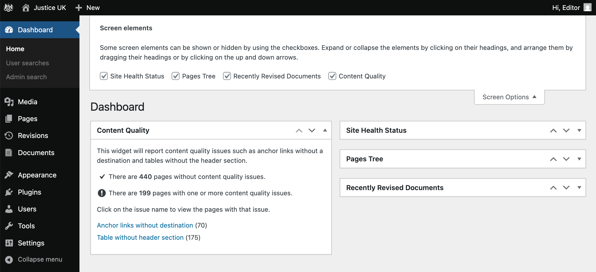
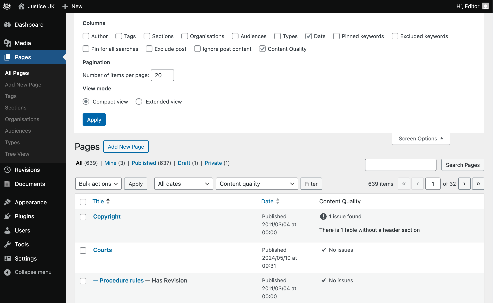
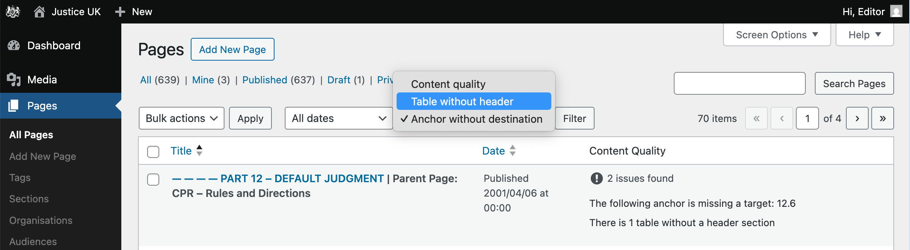
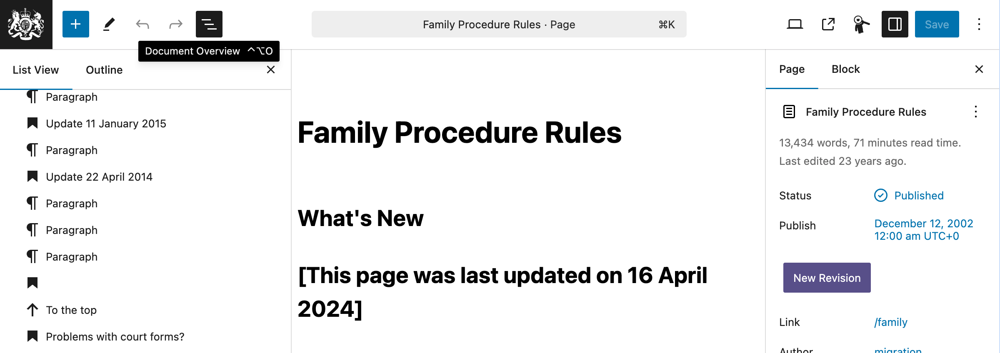

## Table of contents
{: .no_toc .text-delta }

1. TOC
{:toc}

## Overview

<figure class="mb-5">
  

   
   <ol>
      <li id="annotation-screen-options" class="label" style="top: 38%; right: 5%;" >Screen Options</li>
      <li id="annotation-checkbox" class="label" style="top: 30%; left: 54%;" >Checkbox</li>
      <li id="annotation-revision-summary" class="label" style="top: 80%; left: 35%;" >Summary and links</li>
   </ol>
  

  <figcaption>Screenshot of the Dashboard screen with Content Quality widget</figcaption>
</figure>

{: .highlight }
To reveal the Content Quality widget, click the [Screen Options](#annotation-screen-options) button, 
then check the [Content Quality](#annotation-checkbox) checkbox.

The Content Quality widget provides an overview of the content quality issues across your site. It displays a summary of the number of pages with issues and allows you to quickly navigate to those pages.

## Identifying pages with issues

<figure class="mb-5">
  

   
   <ol>
      <li id="annotation-screen-options" class="label" style="top: 36%; right: 5%;" >Screen Options</li>
      <li id="annotation-checkbox" class="label" style="top: 18%; left: 52%;" >Checkbox</li>
      <li id="annotation-revision-summary" class="label" style="bottom: 38%; left: 64%;" >Content Quality column</li>
   </ol>
  

  <figcaption>Screenshot of the Pages admin screen (with issue column)</figcaption>
</figure>

{: .highlight }
To reveal the Content Quality column, click the [Screen Options](#annotation-screen-options) button, 
then check the [Content Quality](#annotation-checkbox) checkbox.

The Content Quality column displays the number of issues for each page.

- If a page has no issues, it will show checkmark icon.
- If a page has issues, it will show a description of the issue(s).

## Filtering pages by issue

<figure class="mb-5">
  

   
   <ol>
      <li id="annotation-filter" class="label" style="top: 18%; left: 52%;" >Issue Filter</li>
   </ol>
  

  <figcaption>Screenshot of the Pages admin screen (with filter)</figcaption>
</figure>

To filter pages by issue, use the [Issue Filter](#annotation-filter) dropdown. This allows you to quickly find pages with specific content quality issues.

## Resolving issues

The following sections can be used as reference for resolving issues, or will be useful when writing new content.

### Anchor without destination

This issue occurs when a [Jump Link](/editing/block-editor.html#links-and-jump-links) is created without a valid target.

Sometimes, this issue will surface over time, as the target of the Jump Link is removed or renamed.

---

On the Pages admin screen, the issue will be displayed as "The following anchor is missing a target: example-target".

This means that there is a Jump Link with the target `#example-target` that does not point to any element on the page.

---

To resolve this issue, you need to edit the page in question and either:

- Remove the jump link that points to the missing target.
- Create a jump link target with the corresponding ID to the page, so that the jump link can point to it.

If necessary, make reference to the [Jump Links section](/editing/block-editor.html#links-and-jump-links) of the Block Editor documentation for more information on how to create jump links.

### Headings without content

This issue occurs when a heading element is empty, meaning it does not contain any text. Empty headings can cause confusion for screen readers and should be avoided.

---

On the Pages admin screen, the issue will be displayed as "There is 1 heading without content".

---

To identify empty headings, from the edit page screen, 

1. Click the "Document overview" button in the top right corner. 
2. This will open the document overview panel, which lists all headings on the page.
3. In the list view, look for the heading icon without any text next to it. This indicates an empty heading.

<figure class="mb-5">
  

   
   <ol>
      <li id="annotation-editor-document-overview" class="label" style="top: 6%;left: 28%;" >Document Overview button</li>
      <li id="annotation-editor-heading" class="label" style="top: 71%; left: 8%;" >Empty heading icon</li>
   </ol>
  

  <figcaption>Screenshot of the Page Edit screen with Document Overview</figcaption>
</figure>

To resolve the issue, you need to either:

- Remove the empty heading element
- Or, add text to the heading element

### Link text uses raw URLs

This issue occurs when a hyperlink displays the full URL as its visible text. While this may be visually understandable to sighted users familiar with web addresses, it can create unnecessary cognitive load for users relying on screen readers. Long URLs are often read out character-by-character or as an unintelligible string, offering little context about the link’s destination.

This practice also affects users with cognitive impairments, who benefit from clear and descriptive link text that communicates purpose without requiring additional interpretation.

---

On the Pages admin screen, the issue will be displayed as "There is 1 link with a URL for the text".

---

Replace raw URLs used as visible link text with descriptive phrases that clearly indicate the link’s purpose or destination. This improves accessibility and usability for all users, especially those using assistive technologies.

Avoid vague phrases like "click here" or "read more". Instead, use meaningful link text that provides context.

e.g. replace the link text "https://www.justice.gov.uk/courts/procedure-rules/civil/rules/part04" with "Civil Procedure Rules Part 4".

{: .highlight }
Historically, using the full URL as link text would have been a means to ensure the link was visible when a page was printed. However, this is no longer necessary, and the full URL to external sites will be appended automatically upon printing.

### Table without header section

This issue occurs when a table is created without a header section. A header section is required for accessibility reasons, as it helps screen readers understand the structure of the table.

---

On the Pages admin screen, the issue will be displayed as "There is 1 table without a header section".

---

To resolve this issue, you need to edit the page in question and add a header section to the table. Then update the table content as necessary.

If necessary, make reference to the [Tables section](/editing/block-editor.html#tables) of the Block Editor documentation for more information on:

- how to add a header section to a table
- how to remove a table row
