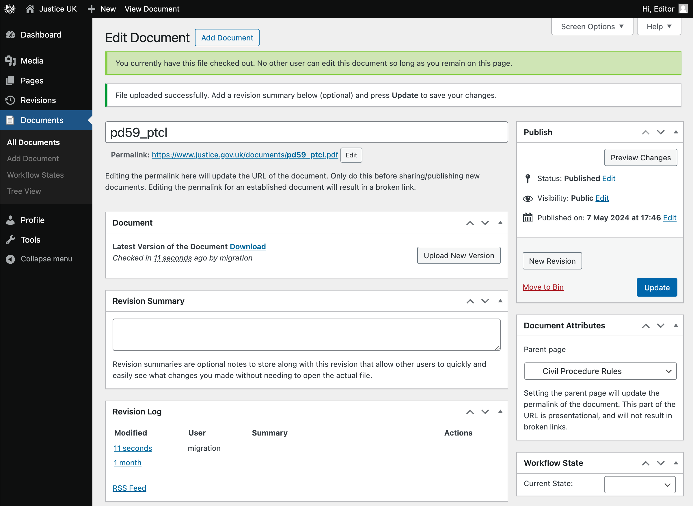
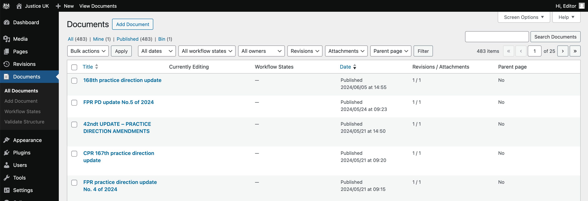

## Table of contents
{: .no_toc .text-delta }

1. TOC
{:toc}

## Overview

  
  <ol>
    <li id="annotation-add" class="label" style="top: 28%; left: 9%;" >Add</li>
    <li id="annotation-title" class="label" style="top: 20%; left: 20%;" >Title</li>
    <li id="annotation-permalink" class="label" style="top: 27%; left: 53%;" >Permalink</li>
    <li id="annotation-upload" class="label" style="top: 47%; right: 40%;" >Upload</li>
    <li id="annotation-revision-summary" class="label" style="top: 57%; left: 28%;" >Summary</li>
    <li id="annotation-parent" class="label" style="top: 72%; right: 24%;" >Parent</li>
    <li id="annotation-workflow-state" class="label" style="top: 88%; right: 24%;" >Workflow State</li>
    <li id="annotation-published-edit" class="label" style="top: 44%; right: 1%;" >Edit</li>
  </ol>

## Uploading a document

To upload a new document, follow these steps (it's safe to click Update at any point to save your progress):

1. Click Documents > Add Document in the Sidebar.
1. Type a title for the document in the Title field.
1. Click Upload New Version to select the document file from your computer.

{: .highlight }
See the annotated screenshot above for the location of the [Add Document](#annotation-add) button, 
[Title](#annotation-title) field and [Upload](#annotation-upload) button.

### Optional document settings

1. After uploading a file, you have the opportunity to add an optional Revision Summary for the document.
   This Revision Summary will be visible only to editors and will assist in tracking changes to the document.
1. A Parent page may optionally be assigned to the Document. 
   This will assist in organizing the document within the site, and form part of the document's URL.
   
   e.g. If the parent is set to Procedure Rules, the document will be accessible 
   at https://www.justice.gov.uk/courts/procedure-rules/documents/doc-title  

   Set this on the right hand side: go to Document Attributes and use the Parent page dropdown.
1. An optional Workflow State can be set to assist in tracking the document's progress.
   This is set on the right hand side: go to Document Attributes and use the Workflow State dropdown.

{: .highlight }
See the screenshot for the location of: the [Revision Summary](#annotation-revision-summary) field,
[Parent page](#annotation-parent) dropdown and [Workflow State](#annotation-workflow-state) dropdown.

### Save & publish the document

1. If you are ready to publish the document, set Visibility to Public and click OK.
1. Click the Publish button.
1. A permalink will be generated for the document. You can change it by clicking the Edit button next to the permalink.
   The permalink is the URL that will be used to access the document.
   Ideally, it should only be set once and should not be changed after the document has been published.
1. Right click the permalink to either copy the link or open it in a new tab.
1. This permalink can now be used to link to the document from other pages on the site.

{: .highlight }
See the screenshot for the location of the [Permalink](#annotation-permalink) field.

### Choosing the document permalink {#document-permalink}

> A document title is typically the first piece of information announced by screen readers when a PDF is opened. When titles are vague, auto-generated, or non-descriptive, it becomes harder for users, particularly those using assistive technologies, to identify and differentiate between documents, especially when multiple PDFs are open or saved locally.

Document permalinks should be structured consistently across the service while still being specific.

A good format to follow is: [Document type]-[Document version]-\[Month\]-\[Year\]

e.g. **civil-procedure-rules-update-no-56-and-57-march-2024** instead of **cpr_update56_57_pdf-1**

{: .highlight }
It is possible to update the document permalink at any time without breaking existing links to the document.  
Changes should only be made to improve the accessibility of a permalink, and frequent changes should be avoided.

### Schedule publication

A document can be scheduled for publication, by setting a published date in the future.

1. Click the Edit button next to the Publish Date.
1. Set the date and time you want the document to be published.
1. Click OK.
1. Click Schedule.

{: .highlight }
See the screenshot for the location of the Published on [Edit](#annotation-published-edit) link.

### Gotchas

1. If you don't set the document's Visibility to Public, then the document will not be accessible to the public.
   This is an easy step to miss, as the default visibility is Private, and as a logged in editor you will be able to see the document regardless of its visibility setting.
1. Setting a published date in the future is OK when creating a document, but be aware that it is not useful for scheduling a revision, because it will take all versions of the document offline until the scheduled date.

## Verifying a successful document upload

From the document edit page, you can verify that the document has been published successfully by checking the following:

1. Right click on the permalink and selecting: Open link in new Incognito window.
   This will open the document in a new browser window where you are not logged in.
   If you can see the document, then it has been published successfully.
1. The document should either display in the browser, or start downloading to your computer.

Another way to identify documents that have not been published is from the list view.

1. On the Sidebar, click Documents > All Documents.
1. At the top of the screen, you'll see a list of document statuses, 
   e.g. Published, Pending, Private... with the number of documents in each status.
   You can click these to show the documents with that status.
1. Ensure that the number of documents with each status is as expected.

From the Documents view, we can also see the number of revisions and attachments for each document. 
This can be useful in identifying any documents where an upload was not completed, or failed.

## Linking to a document from a page

To link to a document from a page, follow these steps:

1. Copy the Document's permalink, either:
   1. from the document's edit page 
   1. or, in the Documents view, hover the document and right-click on View, then click Copy link address.
1. Go to the page you want to link from, and click Edit.
1. Highlight the text you want to link from, and click the Link icon button - it's alongside the bold and italic buttons.
1. Paste the permalink into the URL field.
1. Press the ENTER key to add the link.
1. Click Update to save your changes.

## Uploading a new version of a document

This process is similar to uploading a new document, but with a few differences:

1. Click Documents > All Documents in the Sidebar.
1. Find the document you want by searching and/or sorting.
   Alternatively, if you know the document's URL, you can append `/_admin` and it will take you to the edit page.
1. Click Upload New Version to select the document file from your computer.
1. Add a Revision Summary if necessary.
1. Click Update.
1. Verify the document has been published successfully, by following the steps in the Verify section.

At this stage you should avoid updating the permalink, as this will break any existing links to the document.

## Scheduling a revision

TODO
