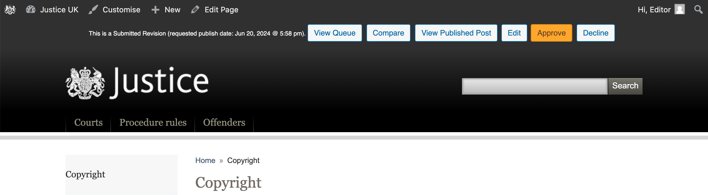

## Table of contents
{: .no_toc .text-delta }

1. TOC
{:toc}

## Overview

<figure class="mb-5">
  

   
   <ol>
      <li id="annotation-publish" class="label" style="top: 4%; right: 5%;" >Publish</li>
      <li id="annotation-page" class="label" style="top: 6%; right: 23%;" >Page</li>
      <li id="annotation-immediately" class="label" style="top: 18.5%; right: 23%;" >Publish immediately</li>
      <li id="annotation-settings" class="label" style="top: 47%; right: 23%;" >Settings</li>
   </ol>
  

  <figcaption>Screenshot of the Page edit screen</figcaption>
</figure>

## Creating a new page

The justice website makes extensive use of page hierarchies to organise content. 
When creating a new page, you will need to correctly set the parent page:
it will determine the URL of the page, and where it will appear in the site's navigation.

To set the parent page at the same time as creating a new page:

<figure class="mb-4">
  

   
   <ol>
      <li id="annotation-tree-view" class="label" style="top: 48%; left: 9%;" >Tree View</li>
      <li id="annotation-add-new-page" class="label" style="top: 48%; left: 48%;" >Add New page</li>
      <li id="annotation-title" class="label" style="top: 56%; left: 51%;" >Title</li>
      <li id="annotation-add" class="label" style="bottom: 15%; right: 62%;" >Add</li>
   </ol>
  

  <figcaption>Screenshot of the Page Tree View screen</figcaption>
</figure>

1. From the Sidebar, click Pages > Tree View.
1. Navigate the page tree to find the parent page.
1. Hover the parent page to and click 'Add new inside'.
1. Enter the page title(s).
  You have the option to create multiple pages at once, but there is less risk of error if you create one page at a time.
1. Click Add.

### Editing page content

For details on how to edit page content, see the [Block editor](./block-editor.md) documentation.

### Additional page settings

When editing a page, you can set additional settings. 
It's more likely that these will be set when creating a new page, rather than editing an existing page.

These settings can be accessed by clicking Page towards the top right of the page editor.

The most used settings are:

1. Navigation
   1. Short title
   1. Title tag
1. Meta data
   1. Show updated at
   1. Modified at (override)
1. Panels
   1. Show menu
   1. Show brand panel
1. Sections
1. Audiences
1. Page Attributes
   1. Parent

{: .highlight }
See the screenshot for the location of the [Page](#annotation-page) tab and
[Settings](#annotation-settings) fields.

### Publishing a new page immediately

To publish a page immediately, click the Publish button in the top right corner of the page editor.

{: .highlight }
See the screenshot for the location of the [Publish](#annotation-publish) button.

### Scheduling a new page for publication

A **new** page can be scheduled for publication, by setting a published date in the future.

1. Navigate to to Page > Publish in the top right corner and click the Immediately button.
1. Set the date and time you want the page to be published.
1. Click x.
1. Click Schedule.
1. Verify the details and click Schedule again.

{: .highlight }
See the screenshot for the location of the [Publish Immediately](#annotation-immediately) link.

### Gotchas

Setting a published date in the future is OK when creating a new page, 
but be aware that it is not useful for scheduling a revision, because it will 
take the page offline until the scheduled date.

## Updating or editing an existing a page

Pages can be edited one of 2 ways, either directly or by creating a new revision. 
Direct editing will update the page immediately, and my be appropriate to fix a broken link or a typo.
Scheduling a revision will allow you to make changes to a page that will go live at a later date, 
and is appropriate for updating pages as legislation is updated.

{: .highlight }
The above screenshot shows the 'Edit Page' and 'New Revision' links.

### Direct editing of a page

1. Edit a page with one of the following methods:
   1. From the Dashboard Sidebar, click Pages > All Pages. Click the page you want to edit.
   1. From the website view, navigate to the page you want to edit. Click the Edit button in the top bar.
1. Make the desired changes.
1. Click Update to save your changes.
1. The changes can be seen immediately on the website, by clicking the View Page button, next to Update.

### Scheduling a revision to an existing page

1. Create a new revision with one of the following methods:
   1. From the Dashboard Sidebar, click Pages > All Pages. Hover the page to reveal a New Revision link.
   1. From the website view, navigate to the page you want to edit. Click the New Revision button in the top bar.
   1. In the edit view of an existing page, click on the New Revision button on the right hand side. 
      The view will update, click the 'Edit Revision' button.
1. Make the desired changes.
1. Update the Publish field to the date/time that you want the revision to go live.
1. Click Submit, then Preview this Revision. If you’re happy with the preview click on the Approve button in the top bar.

{: .highlight }
The above screenshot shows a preview of a revision, with the 'Approve' button.

### Verifying a scheduled revision 

It's important to approve revisions, otherwise it will not be published. You can verify that the revision has been published successfully by checking the following:

1. Click Revisions > Revision Queue from the Sidebar.
1. Any revisions with a status of Scheduled will go live at the time specified in the Schedule column.
1. Any revisions with a status of Submitted will not go live until they are approved.

{: .highlight }
The above screenshot shows the Revision Queue, note the Status column.

After the schedule time has passed, the revision will be live and will not be shown in the revision queue.

To see revisions that have gone live (and direct edits), click Revisions > Revision Archive from the Sidebar.

{: .highlight }
The above screenshot shows the Revision Archive.

### Gotchas

When updating a page, ensure that you have correct page settings, in particular: check 'Meta data' > 'Modified at (override)'.
Set this field, if you want to show a custom Updated date. Unset this field, if you want the page to show the last time it was updated.

## Q & A

### How do I save a page in draft status and find the draft page to re-edit at a later time?

This is a 2 part answer depending on whether you are working on a new page, or an existing page.

If you are working on a new page, you can create a page as usual - as in the 'Creating a new page' section.
After editing, click Save Draft in the top right corner of the page editor.

To find this page at a later date, you can navigate to it via Pages > Tree View.
Alternatively, go to Pages > All Pages and click the Drafts tab towards the top of the screen.

---

If you are working on an existing page, you should create a new revision, not a draft.
Follow the steps in the 'Scheduling a revision to an existing page' section.

Except, submit the revision, but do not approve it, until you are ready for your changes to go live or be scheduled.
To find this revision at a later date, you can navigate to it via Revisions > Revision Queue, 
it will have the status of 'Submitted'.

### How do I delete a draft page?

If you have created a draft page, and no longer need it, you can delete it by following these steps:

1. From the Sidebar, click Pages > All Pages.
1. Click the Drafts tab towards the top of the screen.
1. Hover the page you want to delete, and click the Bin/Trash link.

### How do I cancel a revision to a page?

If you have created a revision to a page, and no longer need it, you can cancel it by following these steps:

1. From the Sidebar, click Revisions > Revision Queue.
1. Hover the revision you want to cancel, and click the Delete link.
